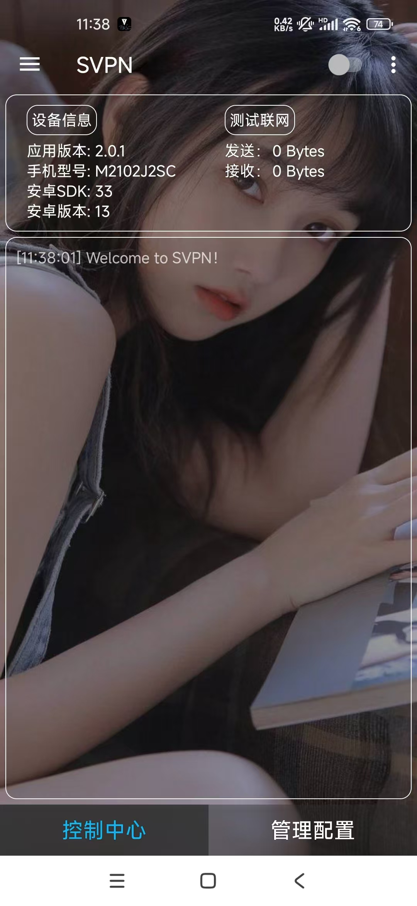

# SVPN
## SVPN是一款适用于安卓手机的代理程序。本源码是最新版半成品已经实现部分代理功能，但还有许多功能需要开发，主要工作是使用VPN拦截数据进行修改和转发。

# 介绍：

## 1.背景
### 本程序由作者上 高中 - 大学 时所著，所属半成品

## 2.开发

###  JAVA:
####   本程序主要用JAVA进行开发，还有许多功能待开发，有能力者可接手更新。。。

###  AIDE:
####   当时用的手机开发的程序，使用的是手机开发工具AIDE。源码可以正常在AIDE正常编译，想要使用Android Studio开发可能需要做一定的调整。

# 截图

<!-- ---------- Screenshots ---------- -->

  
  

